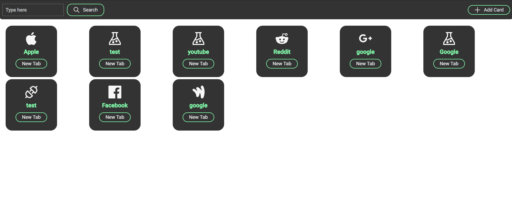
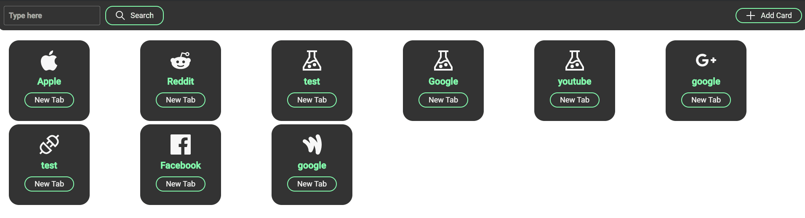
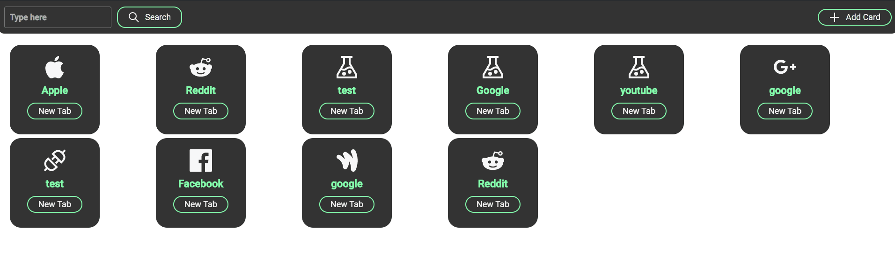

 # Homehub
 Your very own private favourites page for any browser. Simply navigate to [http://localhost:3000/](http://localhost:3000/) once the application is started.
This project deploys a local "*Docker-ized*" application with a front-end container and a back-end container. The front-end container uses a ReactJS Image while the back-end uses a Django Image, mainly used as a DB. 

Here is the application in action! 
- Create a card with any Title, URL and Icon you like! 


- Move the cards into any order you please! 

- Delete older cards you wont be using anymore.


## Installation
Prerequisite: [Docker](https://docs.docker.com/get-docker/) & [Docker-Compose](https://docs.docker.com/compose/install/)

Clone this repository and simply run the following:
```bash
docker-compose up --build
```

## To-do
1. Fix State Issue to allow for live updates on card create and delete
2. Add Google Search functionality to search bar
3. Add theme coloring options 
4. Create Card Preview on New Card page 
5. Create login functionality (for AWS deployment)

## License
[MIT](https://choosealicense.com/licenses/mit/)